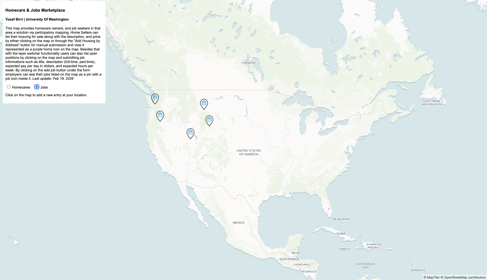

# Homecare & Jobs Map

An interactive web map that allows users to post and explore **homecare housing** and **job opportunities** by location.

>**Website can be found at:** <a>https://homecareapp-5258d509b4b7.herokuapp.com/</a>

The app lets users:

* View housing listings on a map
* View job listings on a map
* Add new housing or job entries
* Submit entries by clicking the map or entering an address
* Switch between Housing and Jobs layers

---

### Housing Layer

* Displays housing markers
* Shows title, description, price, contributor
* Allows adding housing by:

  * Clicking the map
  * Entering an address

### Jobs Layer

* Displays job markers
* Shows job title, description, pay, hours, contributor
* Allows adding jobs directly on the map

---

## 🗺️ API Endpoints

### Housing

GET /api/get-housings
POST /api/add-housing

### Jobs

GET /api/get-jobs
POST /api/add-job

---

## Future Improvements

* User authentication
* Edit / delete postings
* Filtering by price or pay
---

## Author

Created by Yosef Birri

**Source Code** by: Zhao, Bo, 2023, "Crafting Your Own Participatory Mapping Project: A Guide", https://doi.org/10.7910/DVN/VSND2H, *Harvard Dataverse*, V1

